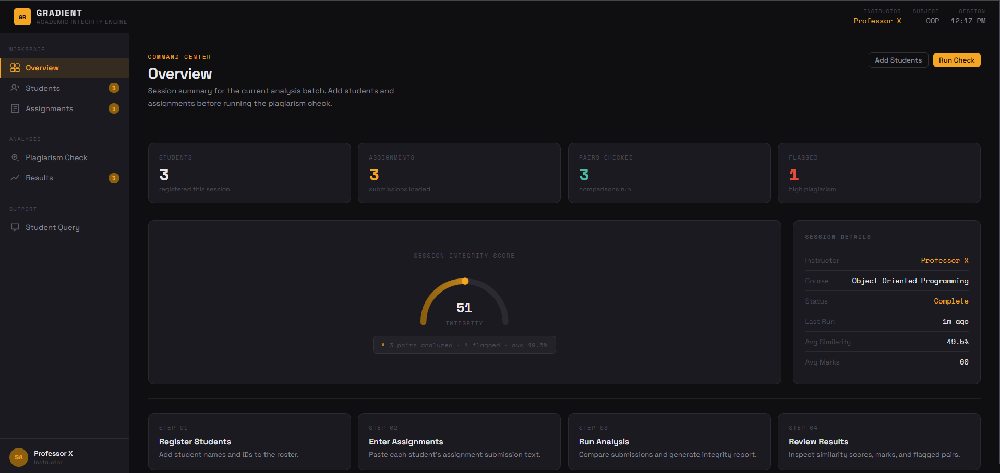
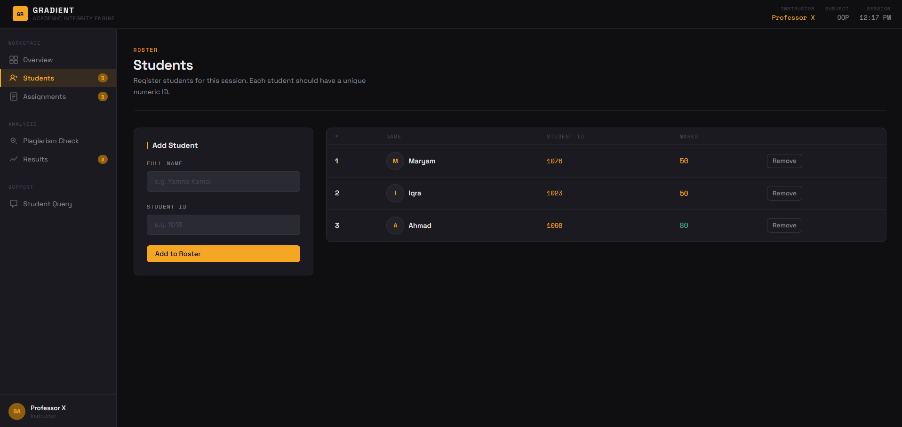
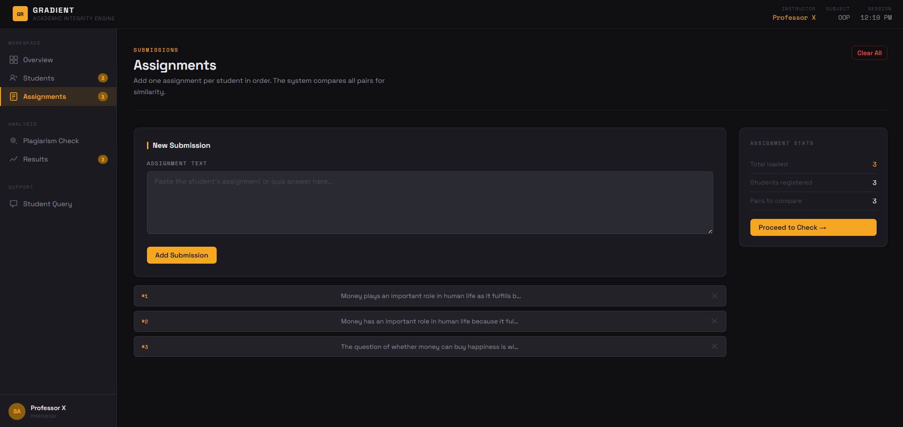
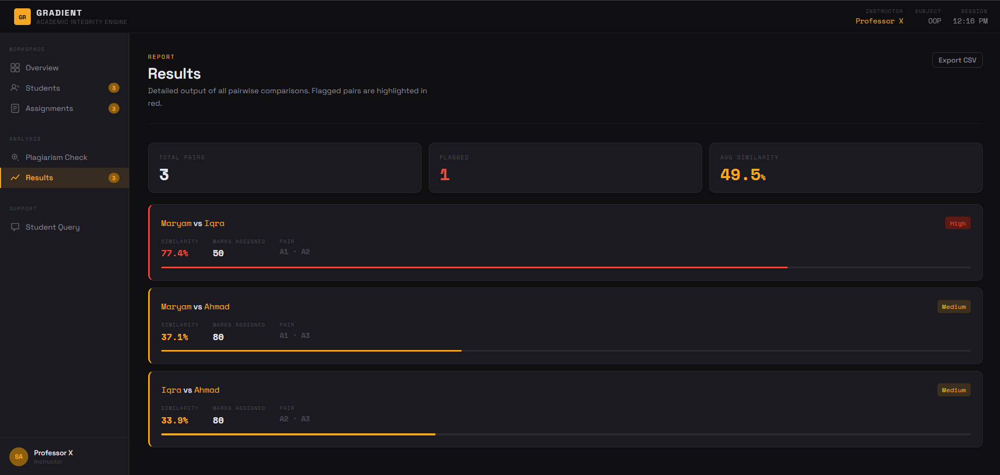
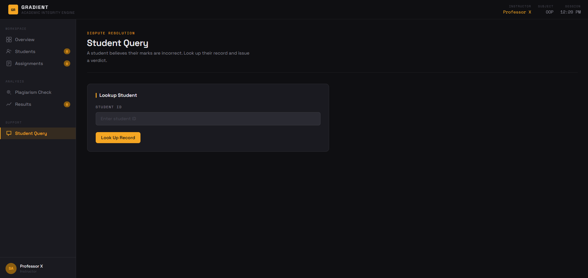
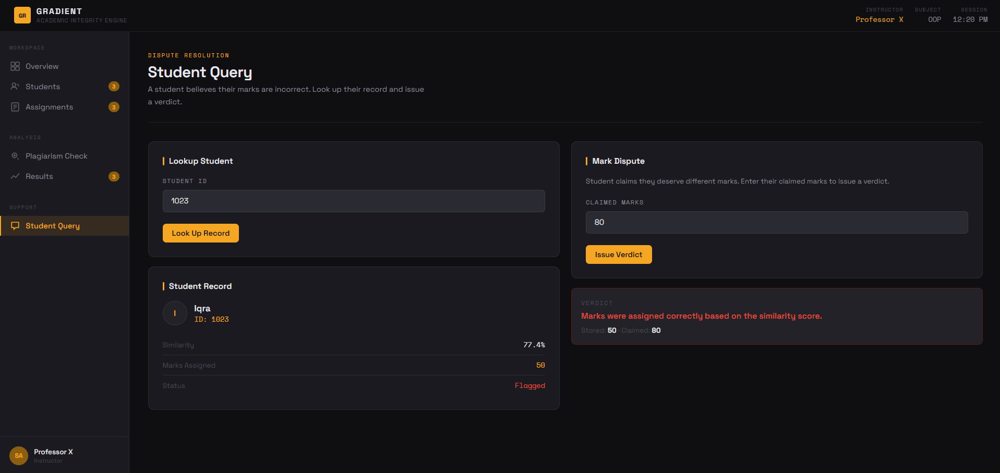

# GR GRADIENT
### Academic Integrity Engine

Gradient is a plagiarism detection and grading system for teachers. It started as a console-based C++ application and was later extended with a full web frontend — giving instructors a clean dashboard to register students, submit assignments, run plagiarism checks, review results, and resolve student mark disputes.

---

## 🖼️ Screenshots

### 🖥️ Dashboard — Overview

> Command center showing session stats: students registered, assignments loaded, pairs checked, flagged count, session integrity score, and step-by-step workflow guide.

---

### 👥 Students Roster

> Register students with full name and ID. The roster table shows assigned marks live after the plagiarism check runs.

---

### 📄 Assignments Submissions

> Paste each student's assignment text one by one. The sidebar tracks total loaded, students registered, and pairs to compare — with a "Proceed to Check" button when ready.

---

### 📊 Results Report

> Detailed pairwise comparison output. High-plagiarism pairs are highlighted in red, medium in yellow, with similarity %, marks assigned, and pair labels shown per row.

---

### 💬 Student Query — Lookup

> Dispute resolution panel where the instructor looks up a student by ID to retrieve their stored record.

---

### ✅ Student Query — Verdict

> After entering the student's claimed marks, the system compares against stored marks and issues an automatic verdict.

---

## ✨ Features

- 🏠 **Overview Dashboard** — Session integrity score, live stats, and step-by-step workflow guide
- 👥 **Student Roster** — Register students with name and ID; view marks after analysis
- 📄 **Assignment Submissions** — Paste and manage assignment texts per student
- 🔍 **Plagiarism Check** — Word-matching similarity algorithm comparing all submission pairs
- 📊 **Results Report** — Color-coded pairwise output (High / Medium / Low) with marks
- 💬 **Student Query & Dispute Resolution** — Look up a student record and issue a verdict on mark complaints
- 💾 **File Persistence** — Results saved to `students.txt` via C++ file handling

---

## 🛠️ Tech Stack

| Layer | Technology |
|---|---|
| Backend Logic | C++ (OOP) |
| Frontend UI | React / HTML + CSS + JavaScript |
| C++ STL | `vector`, `string`, `fstream`, `sstream` |
| Console Output | Windows Console API (colored output) |

---

## 🧩 OOP Architecture (C++ Backend)

```
User  (base class)
├── Teacher   — manages session, runs checks
└── Student   — stores assignment, similarity, marks

PlagiarismChecker  — static similarity & grading logic
ReportFileHandler  — file I/O for saving & querying results
```

**Grading logic:**
- Similarity = 100% → **0 marks** (identical)
- Similarity > 60% → **50 marks** (High plagiarism)
- Similarity ≤ 60% → **80 marks** (Low/Medium plagiarism)

---

## 📁 Folder Structure

```
gradient/
├── main.cpp                  # C++ backend entry point
├── students.txt              # Auto-generated results file
├── frontend/                 # Web UI source
│   ├── index.html
│   ├── css/
│   └── js/
└── screenshots/              # README preview images
```

---

## ▶️ How to Run

### C++ Backend
```bash
g++ main.cpp -o gradient
./gradient
```

### Web Frontend
Open `frontend/index.html` in your browser — no installations required.

---

## 👤 Author
**Yamna Kamal**
